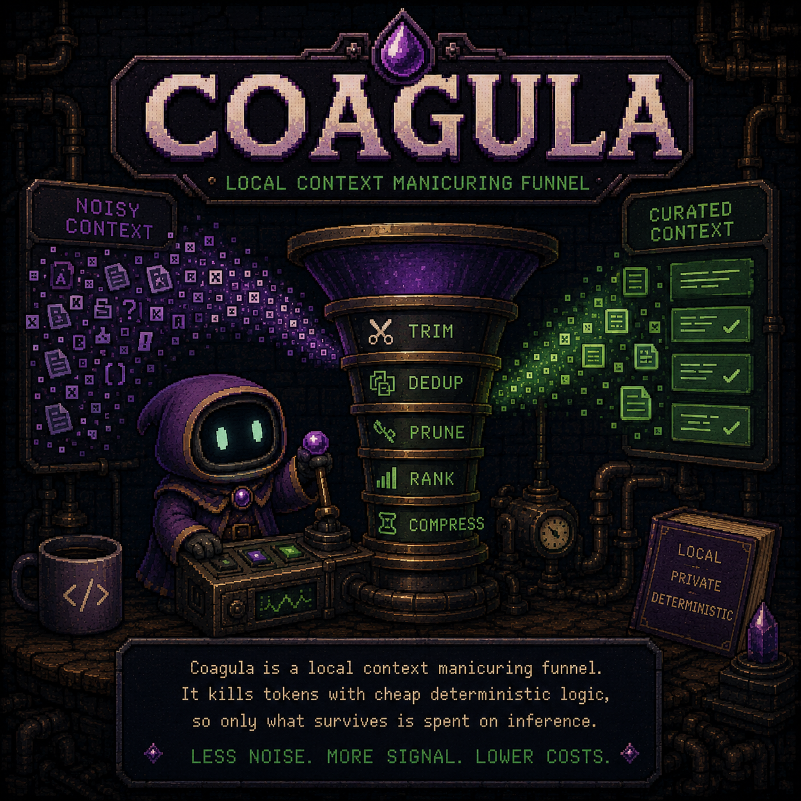

# coagula

<p align="center">
  
</p>

A local **context manicuring funnel**: trim, dedup, prune, rank, and compress
context *before* it reaches an expensive frontier LLM call, so most tokens are
killed by cheap deterministic logic and only what survives is spent on
inference.

Built primarily for noisy diagnostic payloads (kubectl JSON, crashloop logs,
Postgres stats, Azure ARM responses) but works on any context.

## Status

**v0.3.1** — Seven-stage funnel, CLI, MCP adapter library, and a standalone
MCP server (`coagula-mcp`) usable from Claude Code, Claude Desktop, VSCode
1.99+ with GitHub Copilot, and **GitHub Copilot CLI** (with automatic
interception via PowerShell/Bash host hooks). Optional cheap-inference
backends: **Azure OpenAI** (e.g. `gpt-5.4-nano`) and **Ollama** (local).
Runs on the standard library alone — both backends and the MCP SDK are
optional extras. ≥99% token reduction on the SPEC §11 acceptance scenario
with the FATAL signal always preserved.

## Install

```bash
# Library + CLI only:
pip install https://github.com/pat-nel87/coagula/releases/download/v0.3.1/coagula-0.3.1-py3-none-any.whl

# With MCP server:
pip install "coagula[mcp] @ https://github.com/pat-nel87/coagula/releases/download/v0.3.1/coagula-0.3.1-py3-none-any.whl"

# Development:
git clone https://github.com/pat-nel87/coagula.git && cd coagula
pip install -e ".[dev]"
pytest
```

## Use as a CLI

```bash
python -m coagula.cli \
  --query "why is the payments pod crashlooping" \
  --budget 800 --keep 4 --report \
  tests/fixtures/noisy_mixed.txt

# Pipe real noisy context:
kubectl get pod <name> -o json | coagula --query "why is this pod failing" --report
```

## Use as an MCP server (Claude Code / Desktop / VSCode Copilot / Copilot CLI)

The `coagula-mcp` console script speaks MCP over stdio. Register it once and
the LLM gets two tools: `manicure` (trim a payload) and `retrieve` (pull
deferred chunks back). Per-tool JSON pruning via `profile="k8s"|"postgres"|"azure"`.

### Claude Code

```bash
claude mcp add coagula coagula-mcp
```

### Claude Desktop

In `~/Library/Application Support/Claude/claude_desktop_config.json`:

```json
{
  "mcpServers": {
    "coagula": {
      "command": "coagula-mcp"
    }
  }
}
```

### VSCode + GitHub Copilot (1.99+)

In your user `settings.json`:

```json
{
  "github.copilot.chat.mcp.servers": {
    "coagula": {
      "command": "coagula-mcp"
    }
  }
}
```

(Replace the key with whatever your Copilot version expects; the SDK transport
is stdio either way.)

### GitHub Copilot CLI

Add via the interactive `/mcp add` slash command inside a `copilot` session,
or edit `~/.copilot/mcp-config.json` directly:

```json
{
  "servers": {
    "coagula": {
      "command": "coagula-mcp"
    }
  }
}
```

Verify with `/mcp show`. Note that Copilot CLI ALSO supports
[host hooks](#automatic-interception-via-host-hooks), which give true
automatic interception — that's usually the better integration path for
Copilot CLI users. The MCP server is for explicit, LLM-invoked funneling.

### Automatic interception via host hooks

All three major coding-agent hosts now support tool hooks that can transform
tool calls before/after they reach the model. Coverage per host:

| Host | Hook integration | What gets intercepted |
|---|---|---|
| **GitHub Copilot CLI** ≥ 1.0 | [`integrations/copilot-cli/`](./integrations/copilot-cli/) | **Universal** — Bash + view + MCP tool results via `modifiedResult` |
| Claude Code | [`integrations/claude-code/`](./integrations/claude-code/) | Bash only — `updatedInput` rewrites commands before they run |
| VSCode + Copilot Chat (agent mode) | [`integrations/vscode-copilot/`](./integrations/vscode-copilot/) — reuses the Claude Code hook (VSCode reads `.claude/settings.json`) | Bash only |

GitHub Copilot CLI is currently the only host that supports modifying tool
*output* (`postToolUse.modifiedResult`), which makes it the only place
where reads of huge files, MCP tool blobs, and arbitrary non-Bash tools
also get funneled automatically.

Quick install:

```bash
# macOS / Linux / Git Bash:
./integrations/claude-code/install.sh --auto-update-settings   # Claude Code + VSCode Copilot Chat
./integrations/copilot-cli/install.sh                          # Copilot CLI universal interception
```

```powershell
# Windows PowerShell:
.\integrations\claude-code\install.ps1 -AutoUpdateSettings
.\integrations\copilot-cli\install.ps1
```

The hooks ship with both bash and PowerShell ports. Windows installs auto-defer
to Git Bash if it's on PATH and fall back to native PowerShell otherwise — one
config, any platform.

See [integrations/README.md](./integrations/README.md) for the full
capability matrix and per-host install docs.

### Local setup walkthrough: GitHub Copilot CLI

Step-by-step for setting up automatic context funneling in `copilot` on a
fresh machine. End state: every noisy tool call (`bash`, `view`, MCP results)
above 2 000 tokens is silently funneled through `coagula` before the model
sees it.

#### 1. Install the GitHub Copilot CLI

**macOS / Linux:**

```bash
brew install gh
gh auth login                          # GitHub auth + Copilot subscription
gh extension install github/copilot-cli  # or: npm i -g @github/copilot-cli
copilot --version                      # confirm ≥ 1.0
```

**Windows** (PowerShell):

```powershell
winget install GitHub.cli           # or: scoop install gh
gh auth login
gh extension install github/copilot-cli
copilot --version
```

If `copilot` isn't on your PATH after `npm` install, add `$(npm prefix -g)/bin`
to `PATH`. If you're inside an org that disabled hooks, see Troubleshooting.

#### 2. Install `coagula`

```bash
# Released wheel (recommended):
pip install https://github.com/pat-nel87/coagula/releases/download/v0.2.0/coagula-0.2.0-py3-none-any.whl

# Or editable from a clone:
git clone https://github.com/pat-nel87/coagula.git
cd coagula && pip install -e ".[dev]"

# Verify the CLI is on PATH:
coagula --help
```

You also need `jq` (the hook uses it to parse the JSON Copilot CLI streams
in — required for the bash path; the PowerShell path doesn't need it):

```bash
brew install jq            # macOS
sudo apt install jq        # Debian/Ubuntu
winget install jqlang.jq   # Windows (only if using Git Bash)
```

#### 3. Install both hooks

From inside the `coagula` repo:

**macOS / Linux / Git Bash:**

```bash
./integrations/copilot-cli/install.sh
```

**Windows PowerShell:**

```powershell
.\integrations\copilot-cli\install.ps1
```

Either installer copies the hook scripts to `~/.copilot/hooks-bin/` and
writes `~/.copilot/hooks/coagula.json` with **both** `bash` and `powershell`
command fields — Copilot CLI auto-picks per platform, and the PowerShell
hooks themselves further auto-defer to Git Bash if it's on PATH. So a
single config works on macOS, Linux, Windows native, and Windows + Git
Bash. Re-run with `--force` (or `-Force` in PS) to overwrite an existing
config.

#### 4. Verify the hooks fire

```bash
copilot -p "Run 'cat tests/fixtures/crashloop.log' and tell me the dominant error pattern" \
  --allow-all-tools --allow-all-paths --no-color
```

What you should see:

- The model's bash call returns a tiny output prefixed with
  `[coagula: 134715 → 37 tok | tool=bash profile=passthrough]` instead of
  130 KB of log lines.
- Total `in` tokens in the session footer should be ~60 k, not ~150 k.
- The answer ("connection refused: upstream postgres unreachable") is still
  correct.

If you instead see the raw 4 000 lines, the hook didn't fire — jump to
Troubleshooting below.

#### 5. (Optional) Tune for your workflow

All optional.

macOS / Linux (set in `~/.zshrc` / `~/.bashrc`):

```bash
export COAGULA_QUERY="default query"        # overrides per-session inference
export COAGULA_BUDGET=2000                  # funneled output token cap
export COAGULA_KEEP=5                       # top-K chunks kept by relevance
export COAGULA_THRESHOLD=2000               # postToolUse skips outputs under this
export COAGULA_NOISY_PATTERNS="helm|terraform"   # extra preToolUse commands to intercept
export COAGULA_SKIP_TOOLS="my_internal_tool"     # extra postToolUse tools to bypass

# Kill switch:
export COAGULA_DISABLE=1
```

Windows PowerShell (`$PROFILE` or per-session):

```powershell
$env:COAGULA_QUERY      = "default query"
$env:COAGULA_BUDGET     = 2000
$env:COAGULA_KEEP       = 5
$env:COAGULA_THRESHOLD  = 2000
$env:COAGULA_DISABLE    = 1   # kill switch
```

For per-task queries that improve relevance ranking on specific commands,
set `COAGULA_QUERY` to whatever question you're trying to answer right
before you start the `copilot` session.

#### 6. (Optional) Add the MCP server too

The hooks cover automatic interception. The MCP server gives the model an
explicit `manicure(text, query, …)` tool it can invoke deliberately on
context it knows is noisy (e.g., pasting in a big log block). Useful for
sessions where you want manual control:

```bash
pip install "coagula[mcp] @ https://github.com/pat-nel87/coagula/releases/download/v0.2.0/coagula-0.2.0-py3-none-any.whl"

# Register with Copilot CLI:
copilot --add-mcp-server-config '{"servers":{"coagula":{"command":"coagula-mcp"}}}'
# (or edit ~/.copilot/mcp-config.json directly with the same JSON)
```

Verify with `/mcp show` inside an interactive `copilot` session.

#### Troubleshooting

**First step on any problem (Windows or macOS/Linux): run the smoke-test
diagnostic.** It walks 10 checks and tells you exactly what's missing and
how to fix it:

```powershell
# Windows:
.\integrations\windows-smoke.ps1

# Skip the live `copilot` session (if you don't want to burn a premium request):
.\integrations\windows-smoke.ps1 -SkipLiveSession
```

There's no Linux/macOS equivalent script yet — the bash hooks have been
exercised end-to-end against real `copilot` sessions on macOS, and `pytest`
covers the Python paths. If you hit an issue there, walk the same checks
manually: `coagula --help`, `jq --version`, `cat ~/.copilot/hooks/coagula.json`,
`tail -f ~/.copilot/logs/*.log` during a session.

Common specifics:

- **Hook doesn't fire.** Check `%USERPROFILE%\.copilot\logs\` (Windows) or
  `~/.copilot/logs/` (macOS/Linux) for `preToolUse` / `postToolUse` lines.
  Common causes: `jq` not installed (only for the bash path), `coagula` not
  on PATH for the shell `copilot` launched (use absolute paths in
  `coagula.json` if your shell rc isn't sourced for non-interactive bash).
- **"Permission denied" on the hook script.** macOS/Linux: `chmod +x ~/.copilot/hooks-bin/*.sh`.
  Windows: usually an ExecutionPolicy issue — the installer writes
  `powershell -ExecutionPolicy Bypass` which should sidestep this, but
  corporate AppLocker policies can override. Workaround: ask IT to allowlist
  the hook script path, or run `Set-ExecutionPolicy -Scope CurrentUser RemoteSigned`.
- **Funneled output is too aggressive / signal lost.** Raise
  `COAGULA_BUDGET` and `COAGULA_KEEP`, or set `COAGULA_THRESHOLD=10000` so
  only truly enormous outputs get intercepted.
- **Org disabled hooks.** Some GitHub orgs disable Copilot CLI hooks via
  policy. Workaround: use the cross-host MCP server path (step 6) — it's
  LLM-invoked, not policy-restricted.
- **Tool repeatedly re-reads the spill file.** Copilot CLI persists original
  output at `/tmp/copilot-tool-output-*.txt` (or `%TEMP%\copilot-tool-output-*.txt`
  on Windows); the model may go fetch the raw blob if it doesn't trust the
  funneled version. Tune `COAGULA_QUERY` to be specific so the funneled
  result actually contains the signal the model is after.

#### What's verified end-to-end (honest status)

- **macOS:** Library, CLI, MCP server, Ollama, bash hooks in live Copilot
  CLI session — all verified locally.
- **Windows:** Library + CLI + PS hooks parse + installer dry-run +
  synthetic-stdin hook tests + CLI-on-Windows fixture reduction — all
  verified in CI on the Windows-latest runner. A live `copilot` session
  with hooks installed has NOT been verified end-to-end (no Windows box
  in the build env). The smoke script above closes that gap when run on
  a real Windows machine.
- **Azure OpenAI:** Mocked tests pass; live calls against a real tenant
  not verified (set `RUN_AZURE_TESTS=1` + the four `AZURE_OPENAI_*` env
  vars to exercise locally).

### Optional: route the funnel's embed + summarize tier through a cheap model

By default `coagula`'s `Relevance` stage uses TF-IDF and `Summarize` is
extractive — both stdlib, no model call. For better quality on noisy
diagnostic payloads, route those two stages through a cheaper-than-frontier
LLM. `coagula-mcp` auto-detects the configured backend at startup with this
priority: **`COAGULA_BACKEND` override → Azure OpenAI → Ollama → stdlib
fallback**.

#### Azure OpenAI (cheap before the frontier model)

Designed for the "cheap private compression before Claude / GPT-4" pattern.
Set the env vars before starting `copilot` (or any MCP-host) and the funnel
routes through your Azure deployment:

```powershell
# Windows PowerShell — same names work in bash via `export`:
$env:AZURE_OPENAI_ENDPOINT         = "https://my-resource.openai.azure.com"
$env:AZURE_OPENAI_API_KEY          = "..."
$env:AZURE_OPENAI_LLM_DEPLOYMENT   = "gpt-5.4-nano"           # or gpt-4o-mini
$env:AZURE_OPENAI_EMBED_DEPLOYMENT = "text-embedding-3-small" # optional
$env:AZURE_OPENAI_API_VERSION      = "2024-10-21"             # optional
```

The `LLM_DEPLOYMENT` is required for the funnel to wire Azure; the
`EMBED_DEPLOYMENT` is optional — without it, `Relevance` keeps its TF-IDF
fallback.

**Cost arithmetic** on the SPEC §11 noisy_mixed scenario (135k tokens in,
the worst case):

| Stage | Token cost | Where |
|---|---|---|
| Normalize / Dedup / Prune (lossless) | $0 | deterministic, stdlib |
| Relevance + Summarize via `gpt-5.4-nano` / `gpt-4o-mini` | ~$0.0002 | Azure |
| Frontier model (Claude / GPT-4) sees | ~700 tokens | huge savings |

**Library usage** (without the MCP server):

```python
from coagula import default_funnel
from coagula.models.azure_openai import make_embedder, make_llm

embed = make_embedder("text-embedding-3-small",
                      endpoint="https://my-resource.openai.azure.com",
                      api_key=os.environ["AZURE_OPENAI_API_KEY"])
llm   = make_llm("gpt-5.4-nano",
                 endpoint="https://my-resource.openai.azure.com",
                 api_key=os.environ["AZURE_OPENAI_API_KEY"])
funnel = default_funnel(embedder=embed, llm=llm, max_tokens=2000, keep=5)
```

Both factories accept a `fallback` callable that fires on Azure errors (401,
timeout, missing deployment) so a transient Azure outage degrades to TF-IDF
rather than crashing the funnel.

#### Ollama (local + offline)

```bash
# Install (macOS):
brew install --cask ollama-app
open -a Ollama
ollama pull nomic-embed-text llama3.2:3b

# The coagula-mcp server auto-detects Ollama and wires it in.
# Override defaults:
#   OLLAMA_HOST=http://localhost:11434
#   COAGULA_EMBED_MODEL=nomic-embed-text
#   COAGULA_LLM_MODEL=llama3.2:3b
```

Auto-detection picks **Azure first** when both Azure env vars and a reachable
Ollama are present. Force a specific backend with `COAGULA_BACKEND=azure`,
`ollama`, or `fallback`.

## Use as a library (embed in your own MCP tool)

```python
from coagula.mcp import coagula_payload, ChunkSpec

result = coagula_payload(
    [
        ChunkSpec(text=kubectl_json, kind="json", source="kubectl/pod"),
        ChunkSpec(text=crashloop, kind="log", source="logs/payments"),
        ChunkSpec(text=fatal_line, source="alerts", severity="FATAL"),
    ],
    query="why is this pod crashlooping",
    profile="k8s",
    max_tokens=2000,
    extra_critical_patterns=[r"payment_id=\d+"],
)
print(result.prompt)               # the cleaned context
print(result.deferred_manifest)    # what got demoted, retrievable by id
print(result.report)               # per-stage savings table
```

## Design

Stages run in fixed order, cheap-before-expensive:

```
normalize → dedup → prune → relevance → summarize → budget → assemble
```

Everything is **demote, not delete**: pruned chunks become `DEFERRED` and are
retrievable on demand via the `DeferredStore` / `retrieve` MCP tool.
`CRITICAL` chunks are sacrosanct — never demoted, never dropped. Severity
pinning at ingestion (`severity="FATAL"|"ERROR"` → `CRITICAL`) is the
correctness guarantee that compensates for an imperfect relevance ranker.

See `SPEC.md` for the full contract.

## What this isn't

- **Not an automatic interceptor when used purely as an MCP server.** MCP
  tools are LLM-invoked. For automatic interception (no model effort),
  use the host hooks under `integrations/` — GitHub Copilot CLI gets
  universal coverage; Claude Code and VSCode Copilot Chat get Bash-only.
- **Not a vector DB / RAG store.** The funnel is stateless per request
  except for the per-request deferred store.
- **No telemetry, no network egress on the default path.** Ollama is local;
  the MCP server is stdio.

## License

`coagula` is licensed under the [Apache License, Version 2.0](./LICENSE).
See [NOTICE](./NOTICE) for attribution requirements.

In short:
- Free for any use — personal, commercial, hosted, embedded.
- Modify and redistribute freely; keep the copyright + NOTICE.
- Patent grant from contributors; patent retaliation if you sue.
- Provided **as-is**, no warranty.

For vulnerability reports see [SECURITY.md](./SECURITY.md). To contribute,
see [CONTRIBUTING.md](./CONTRIBUTING.md) — every commit must be DCO-signed
(`git commit -s`).
